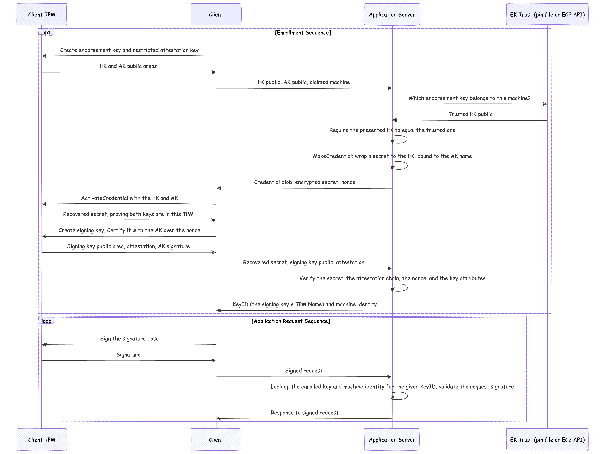

# Attested TPM keys



A signing key that lives inside a TPM, admitted to the server only after the
TPM attests to how the key was made.

An enrollment establishes a chain, each link checked by the server:

```
signing key -> attestation key -> endorsement key -> a machine
```

**The signing key.** `TPM2_Certify` signs a statement about the signing key's
public area with a restricted attestation key (AK). What that statement proves:

| Attribute | Why the server checks it |
| --- | --- |
| `fixedTPM` | the private key cannot be migrated out of this TPM |
| `sensitiveDataOrigin` | the TPM generated the private key, nobody imported it |
| `sign` | the key is usable for signatures |
| not `restricted` | the key may sign an HTTP signature base, which is not a TPM-generated structure |

The AK itself *is* `restricted`, which is what makes its signature evidence
rather than an assertion: a restricted key will only sign structures the TPM
produced, so an AK signature over an attestation cannot have been forged over
arbitrary bytes.

**The attestation key.** `TPM2_MakeCredential` and `TPM2_ActivateCredential`
bind the AK to an endorsement key (EK). The server wraps a secret so that it can
only be recovered by the holder of a particular EK's private half, and only
while that particular AK is loaded in the same TPM. Recovering the secret is
proof of both at once. The server needs no TPM of its own to do this.

**The machine.** Which EK to believe is the one decision that is not
cryptography, so it is pluggable:

| `--ek-trust` | Where trust comes from | Identity | Runs on |
| --- | --- | --- | --- |
| `pinned` (default) | a file of endorsement keys, each with a label | the label | any TPM whose state persists |
| `ec2` | `ec2:GetInstanceTpmEkPub` for the instance the client claims to be | the instance ID | AWS NitroTPM |
| `insecure-tofu` | accepts any EK, names it after its digest | `ek:<digest>` | local testing |

Only `ec2` uses the client's claim about which machine it is, as a lookup key,
and it needs no authentication: the published key for that instance has to equal
the one presented, so naming an instance you are not fails before a challenge is
even issued. The client fills the claim in from IMDS when `--claim` is not given.
`pinned` and `insecure-tofu` ignore the claim entirely, since the endorsement key
itself is what they recognise.

Two rounds, because activation requires a round trip:

1. client sends its EK and AK public areas, and a claim
2. server checks the EK against its trust source, then returns a wrapped secret
   and a nonce
3. client recovers the secret with `TPM2_ActivateCredential`, creates the
   signing key, and certifies it with the nonce as qualifying data
4. client sends the secret, the signing key, and the certification
5. server checks the secret, the certification chain, and that the nonce is its
   own, then admits the key

The nonce is why an attestation cannot be replayed into a later enrollment, and
a challenge is consumed on first use either way.

The httpsig keyid is the signing key's TPM Name, a digest of its whole public
area, so the identifier a signature claims is exactly the object that was
attested. The identity a verified request carries is the machine, never
something the client named for itself.

### What this still does not prove

Nothing here inspects PCRs, so an enrollment says where a key lives, not what
the machine booted. Measured boot needs a story for managing known-good PCR
values across kernel updates, which this does not have.

Neither enrollment endpoint authenticates its caller, and does not need to: a
client can only enroll for a machine whose EK the server already trusts, and
only by proving it holds that EK.

## Running locally

The client can run an embedded software TPM, the Microsoft reference
implementation, so no hardware is needed. It is compiled in via cgo behind the
`tpmsim` build tag, so building it needs openssl headers (`openssl-devel`).

```sh
# terminal 1: accepts any endorsement key, so no pin file is needed
make tpm_server

# terminal 2
make tpm_client
```

`make tpm_server` passes `--ek-trust insecure-tofu`, and with the embedded
simulator it has to: that simulator generates a fresh endorsement seed in every
process, so its endorsement key is different on each run and there is nothing
stable to pin.

On a machine with a real TPM, pinning works, and that is the same path the EC2
deployment takes. Publish the endorsement key once, then trust it:

```sh
# reading a TPM device needs root, or whatever group owns it (often tss)
sudo ./bin/tpm_client --tpm-path /dev/tpmrm0 --print-ek > ek.json
./bin/tpm_server --ek-trust pinned --ek-file ek.json
sudo ./bin/tpm_client --tpm-path /dev/tpmrm0
```

Without the build tag the client is pure Go and static, and requires
`--tpm-path`. That is what gets deployed.

## Running on real NitroTPM hardware

[NitroTPM][nitrotpm] gives an EC2 instance a TPM 2.0 device at `/dev/tpmrm0`.
Two things are awkward about getting one:

* Linux has no prebuilt NitroTPM AMI, and NitroTPM cannot be enabled on an
  existing image. A new AMI has to be registered over the same root snapshot
  with `--tpm-support v2.0`, and `RegisterImage` only accepts a snapshot you
  own, so the snapshot has to be copied first.
* Neither the copy nor the registration has a CloudFormation resource, so those
  two steps are a script and everything else is a stack.

```sh
# 1. copy an arm64 AL2023 root snapshot and register it with a TPM.
#    Prints the AMI ID; re-running reuses the existing AMI.
AMI=$(./deploy/create-nitrotpm-ami.sh)

# 2. the instance, its SSM instance role, a staging bucket, and a security
#    group with no ingress at all
aws cloudformation deploy --stack-name httpsig-scratch-nitrotpm \
  --template-file deploy/nitrotpm.yaml --capabilities CAPABILITY_IAM \
  --parameter-overrides ImageId=$AMI VpcId=$VPC_ID SubnetId=$SUBNET_ID

# 3. build the static binaries, pin the endorsement key AWS publishes for the
#    instance, stage everything, and run the demo against /dev/tpmrm0 in both
#    pinned and ec2 trust modes
./deploy/run-on-instance.sh
```

Every step reads `AWS_REGION`, and the scripts find the repository from their own
location, so they can be run from anywhere.

The instance type must be one that [supports NitroTPM][nitrotpm-reqs]; the
template defaults to `c7g.medium`. Nothing listens on a public port: the client
and server both run on the instance and talk over loopback, and all access is
through SSM, which is outbound only.

`--ek-trust=ec2` needs `ec2:GetInstanceTpmEkPub`, which the template grants the
instance role for instances tagged `Name=httpsig-scratch-nitrotpm`, so the server
can only anchor enrollments to the demo host. Region comes from IMDS, which the
AWS SDK has to be told to consult.

Excerpts from a run, showing enrollment anchored to the control plane, an
unsigned request, and a key the server has not been told to trust. The identity
is the instance, and the keyid is the TPM Name of a key that cannot leave that
instance's TPM:

```
crw-------. 1 root root 253, 65536 /dev/tpmrm0
level=INFO msg="using TPM device" path=/dev/tpmrm0
level=INFO msg="read instance ID from IMDS" claim=i-03091e293401c5556
level=INFO msg="recovered the activation secret, proving this TPM holds the endorsement key"
level=INFO msg="enrolled TPM key" key_id=000b42920a4ba3ff... identity=i-03091e293401c5556 source=ec2

hello, i-03091e293401c5556! (signed by TPM key 000b42920a4ba3ff..., trusted via ec2)
===== unsigned request, expect 401 =====
401
===== an endorsement key that is not pinned must be refused =====
level=ERROR msg="server refused to issue a challenge" error="endorsement key not trusted: endorsement key is not pinned"
```

## Cleaning up

```sh
./deploy/cleanup.sh
```

Empties the bucket, deletes the stack, then deregisters the AMI and deletes its
snapshot. Each deletion is confirmed separately; `-y` skips the prompts. The
bucket has to be emptied first, because CloudFormation will not delete a bucket
that still has objects in it.

[nitrotpm]: https://docs.aws.amazon.com/AWSEC2/latest/UserGuide/nitrotpm.html
[nitrotpm-reqs]: https://docs.aws.amazon.com/AWSEC2/latest/UserGuide/enable-nitrotpm-prerequisites.html
